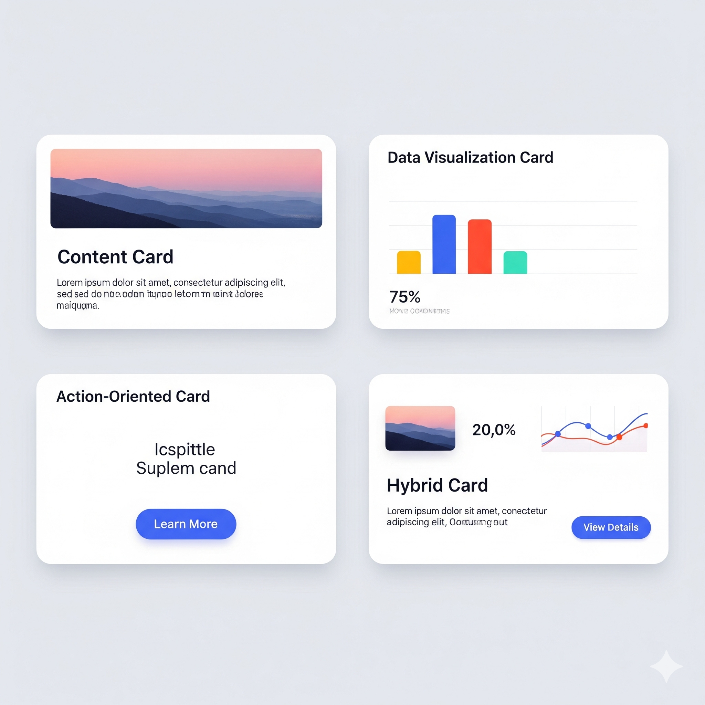

# a. 界面元素 
用户界面设计领域（UI，User Interface），共有 36个原子元素，15 个组合元素。
- 一、布局类
- 二、导航类 
- 三、信息展示类  
- 四、媒体与数据可视化
- 五、排版与装饰 
- 六、输入与交互控件
- 七、反馈与提示 
- 八、组合型界面元素


## 一、布局类 
布局与结构（Layout & Structure）

### 📐 1. 栅格系统 

栅格系统(Grid / Flexbox) 是现代网页设计的重要基础，它为**内容布局**提供了规范化的解决方案。

#### (1) 作用
- 对齐元素，使界面看起来统一  
- 排列有序、减少视觉混乱，使阅读更轻松  
- 响应式设计，多种客户端下保持良好布局、完美适配   
- 设计提效，不用每次都重新思考布局，开发更容易实现   

#### (2) 常见栅格系统
- 12列栅格系统（最流行）
> 将页面宽度分成12等份，内容可以占1列、2列、3列...或者组合使用，Bootstrap、Material Design都在用。
> 
```
常用布局组合：
6 + 6  = 两栏等宽布局
8 + 4  = 主内容区 + 侧边栏
4 + 4 + 4  = 三栏等宽布局
```
- 8列栅格系统
> 适合移动端设计，更简洁的布局选择。

#### (3) 使用方法 
步骤：设置栅格 - 对齐元素 - 使用栅格的间隙 gutter 作为元素间距 


#### (4) 实际案例
- 导航栏：Logo占2列，菜单占8列，用户头像占2列
- 内容区域：主内容占8列，侧边栏占4列
- 卡片布局：每个卡片占4列，一行放3个

#### *>> 拓展内容*

<details>
<summary>Bootstrap简介</summary>  

>.  
> Bootstrap是什么？
> - 一个前端框架，主要给程序员用的  
> - 提供了大量预制的UI组件（按钮、表格、导航栏等）  
> - 程序员可以快速搭建网站，不用从零开始写代码  
>  
> 对UI设计师的意义：
> - Bootstrap定义了很多标准的设计规范
> - 比如按钮尺寸、颜色、间距等都有统一标准
> - 很多网站都基于Bootstrap，所以了解它有助于理解常见的网页布局

</details>

<details>
<summary>Material Design简介</summary>

>.  
> Material Design是什么？
> - Google制定的设计语言
> - 不只是给程序员的，更是给设计师的完整设计指南
> - 包含颜色、字体、动效、交互等各方面规范
> 
> 核心理念：
> - 拟物化概念：像纸张一样有层次、阴影
> - 统一体验：Android、Google网站都遵循这套规范
> - 响应式：适配各种设备尺寸
> 
> 实际应用：
> - Android应用的标准设计风格
> - Gmail、YouTube等Google产品都在用
> - 很多设计工具（Figma等）都有Material Design组件库

</details>

<details>
<summary>Bootstrap vs Vue 对比</summary>

>. 
> 特点 | Bootstrap | Vue
> -- | -- | --
> 类型 | CSS框架 | JavaScript框架
> 主要作用 | 样式和布局 | 应用逻辑和数据处理
> 解决问题 | 让网页好看 | 让网页有交互功能
> 
> Bootstrap（样式层）： 
> - 提供现成的CSS样式和组件
> - 解决"界面长什么样"的问题
> - 包含按钮、表格、导航栏等视觉组件
> - 专注于外观和布局
> 
> Vue.js（逻辑层）：
> - JavaScript应用开发框架
> - 解决"界面如何工作"的问题
> - 处理用户交互、数据变化、页面跳转等逻辑
> - 专注于逻辑和功能 
> 
> 生活化理解：想象装修一套房子
> - Bootstrap = 装修材料（地板、墙纸、家具） → 决定房子的外观
> - Vue.js = 智能家居系统（灯光控制、温度调节） → 决定房子的功能
> 
> 实际分工举例：
> - Vue.js负责： 按钮点击后的弹窗显示、表单数据验证、页面路由跳转
> - Bootstrap负责： 按钮的样式设计、弹窗的视觉效果、整体页面布局
> 
> 对UI设计师的意义：
> - Bootstrap 直接相关性高！提供可参考的设计规范和组件样式，影响日常设计决策和组件选择，需要深入了解其栅格系统和组件设计原则。
> - Vue.js 主要供开发者使用，了解基本概念有助于与开发团队更好协作，理解哪些交互效果在技术上容易实现。
> 
> 同类技术对比：
> - Bootstrap的同类： Tailwind CSS、Bulma、Foundation（样式框架）
> - Vue.js的同类： React、Angular、Svelte（JavaScript框架）

</details>

---
### 🏗️ 2. 容器 / 区块  

容器(Containers / Sections) 是页面布局的基础单元，用于包裹和组织页面内容，确保内容在不同设备上的合理展示。

#### (1) 作用
- 视觉组织：相关内容归类，让界面看起来整洁有序。
- 信息层次：帮助用户快速理解哪些内容是相关的。
- 布局控制：更好地安排元素在页面上的位置。
- 响应式设计：在不同设备上保持良好的显示效果。

#### (2) 使用技巧
- 保持一致性：同类容器使用相同的样式
- 留白很重要：容器内外都要有适当的间距
- 层次分明：用不同的背景色、边框来区分重要程度

#### (3) 常见容器 
- 卡片（Cards）：适合展示独立的信息块，比如商品、文章预览。
- 面板（Panels）：较大的区域，用来组织复杂内容，常见于仪表板、设置页面。
- 模态框（Modals）：弹出式容器，暂时覆盖主界面，用于重要提示或表单填写。* 模态（Modal）或半模态（Semi-modal）
- 标签页（Tabs）：将内容分组到不同的"页签"中，节省空间，适合相关但不同的内容类型。


---

### 🗂️ 3. 面板 / 折叠面板 / 抽屉 
(Panels / Accordions / Drawers)，动态交互元素、动态面板（Dynamic Panel）  
面板（Panels）是界面中用来组织和展示相关内容的容器区域。  
#### (1) 常见面板类型   
> 信息面板：显示用户资料、统计数据等  
> 控制面板：包含各种设置选项和操作按钮  
> 侧边面板：通常固定在屏幕一侧，显示导航或工具  
> 浮动面板：可以拖拽移动的独立窗口  

折叠面板（Accordions）是一种特殊的面板，可以展开和收起内容。  
#### (2) 折叠面板的特点   
> 节省屏幕空间，一次只显示需要的内容  
> 通过点击标题栏来展开/收起  
> 常用于FAQ、设置选项、产品详情等场景  

抽屉（Drawers）是从屏幕边缘滑出的面板，就像拉开抽屉一样。它们通常隐藏在界面边缘，需要时才出现。  
#### (3) 抽屉的用途 
> 导航抽屉：包含主要菜单选项  
> 工具抽屉：放置常用工具和功能  
> 详情抽屉：显示选中项目的详细信息  

---

### ➖ 4. 分隔线 / 空白 / 间距  
(Divider / Spacer)  
好的设计不是添加更多元素，而是知道什么时候停止添加。空白让界面"呼吸"，给内容足够的空间；间距大小能表达内容的重要程度。  
#### 作用
- 建立视觉层次：通过不同大小的间距，用户能快速理解哪些内容相关，哪些内容独立。  
- 提升可读性：适当的空白和间距让文字更容易阅读，减少视觉混乱。  
- 引导用户注意力：空白可以像聚光灯一样，突出你最想让用户看到的内容。  
- 营造情感氛围：紧密间距，营造紧张、忙碌的感觉；宽松间距，营造轻松、高端的感觉。

分隔线（Divider）是界面中的"分割线"，用来清晰地区分不同的内容区域。  
> 常见的分隔线类型：  
> 实线分隔：最常见，用细线分开内容
> 虚线分隔：较为柔和，适用于不那么重要的分割
> 阴影分隔：用阴影效果代替线条，更现代
> 渐变分隔：颜色渐变的分割效果  

空白（Whitespace）是界面中没有任何元素的区域，也叫"负空间"。
> 空白的作用：
> 提供视觉休息：让用户眼睛不疲劳  
> 突出重点内容：周围空白越多，内容越显眼  
> 提升阅读体验：适当空白让文字更易读
> 营造高级感：简洁的留白让界面看起来更专业  

间距（Spacing）是元素之间的距离，它决定了界面的节奏感和视觉层次。
> 间距的类型：  
> 内边距（Padding）：元素内部内容与边框的距离
> 外边距（Margin）：元素与其他元素之间的距离
> 行间距（Line Height）：文本行与行之间的距离
> 字间距（Letter Spacing）：字符之间的距离  

--- 

## 二、导航类 
Navigation
导航是界面设计的“交通系统”，帮助用户在产品中顺畅地移动。可分为 “主要导航” (核心功能) 和 “次要导航” (辅助功能)。

### **1.主要导航元素**

| 元素名称 | 常见平台 | 核心作用 | 适用场景 | 备注 |
| :--- | :--- | :--- | :--- | :--- |
| **底部标签栏** (Bottom Tab Bar) | **App端** | 核心功能切换 | 核心功能 ≤ 5个的App | 始终可见，高效 |
| **顶部导航栏** (Top Navigation Bar) | **PC端** | 展示所有主功能 | 功能层级清晰的网站 | 一目了然，发现性好 |
| **侧边抽屉导航** (Drawer) | **App & PC** | 隐藏大量功能 | 功能过多或响应式设计 | 节省空间，但发现性弱 |

### **2.次要导航元素**

| 元素名称 | 常见平台 | 核心作用 | 适用场景 | 备注 |
| :--- | :--- | :--- | :--- | :--- |
| **侧边栏** (Sidebar) | **App & PC** | 展示辅助内容/工具 | 后台管理系统、博客/新闻网站 | **与主内容并列显示**，常驻 |
| **面包屑导航** (Breadcrumbs) | **PC端** | 告知用户当前位置 | 层级较深的网站（如电商）| 提供了返回上级的路径 |
| **列表导航** (List Navigation) | **App & PC** | 结构化内容 | 设置页面、文章目录 | 清晰、适合深层级信息 |
| **分段控件** (Segmented Control) | **App端** | 同一页面内切换 | 切换子功能或内容视图 | 简洁高效，不适合过多选项 |
| **文字链** (Text Links) | **App & PC** | 提供上下文链接 | 网页底部链接、文章内引用 | 最基础的导航方式 |
| **分页器** (Pagination) | **App & PC** | 分页浏览大量内容 | 表格数据、商品列表 | 手机端常被**无限加载**替代 |

--- 


## 三、信息展示类  
Information Display

### 1. 卡片
<details>
<summary>Card</summary>
  
  

</details>
 
#### (1) 内容聚合卡片 
Content Aggregation Card，将相关的信息打包在一起，让用户可以快速浏览和理解。
- 样式特点：通常包含标题、图片、简短描述或标签。通常有阴影或边框，使其看起来像“浮”在页面上。
- 使用场景：新闻或博客列表、商品列表、个人主页动态卡片。

#### (2) 功能操作卡片  
Action-Oriented Card，不仅展示信息，更重要的是引导用户进行下一步操作。  
- 样式特点：通常还会包含按钮、链接或可点击区域。 
- 使用场景：任务待办卡片、功能入口卡片（如 我的订单）、推荐与邀请卡片。

#### (3) 数据展示卡片 
Data Visualization Card，用于清晰地展示数据或统计信息，帮助用户快速理解当前状态。
- 样式特点：内容通常是数字、图表或进度条，突出关键数据，可能带有单位或时间范围等辅助信息。
- 使用场景：仪表盘、后台管理系统、健康类应用、财务类应用。

#### (4) 混合卡片
Hybrid Card，包含了内容展示和功能操作。
- 样式特点：通常包含图片、标题、描述、标签等信息，有明确的行动按钮。
- 使用场景：文章卡片（点赞、评论、分享按钮），活动通知（立即报名按钮），招聘信息（投递简历按钮）。

--- 

### 2. 列表 / 表格 
List / Table，用于组织和展示多条数据记录的容器。列表通常用于展示非结构化或单个数据项，而表格则用于展示结构化、多维度的数据。 

#### 列表 (List) 的应用场景：
- 新闻列表
- 联系人列表
- 聊天消息列表

#### 表格 (Table) 的应用场景：
- 数据报表
- 后台管理系统中的用户/订单列表
- Excel 表格数据展示

--- 

### 3. 标签 / 徽章 
Tag / badge 

#### 标签分类 Tags
- 可点击标签（Clickable Tags）：筛选、导航、分类。
  > 例子：电商网站上的商品标签（如“热卖”、“新品”），点击后可以查看更多符合此标签的商品；文章或视频的关键词标签。
- 展示性标签（Descriptive Tags）或状态标签（Status Tags）：作为内容的补充说明，快速传达某个状态或属性。
  > 例子：在文件列表中，一个文件旁边有一个“草稿”标签。它告诉你这个文件的状态是草稿，但你无法通过点击它来执行任何操作。
  > 例子：在商品图片上，一个“售罄”的标签。它只是用来告知商品的状态，而不能点击。

#### 徽章 Badge 
徽章则更像是一个状态指示器。它的主要作用是提醒、通知或显示某个实时状态。它通常是不可点击的，只起展示和提示的作用。  
应用场景：  
- 未读消息： 社交软件的图标上，会有一个小红点或数字徽章，提示用户有未读消息。
- 购物车数量： 电商APP的购物车图标上，会显示已加入商品的数量。
- 新功能提示： 在某个新功能入口旁边，会有一个小红点或“新”字徽章，吸引用户注意。
- 成就和荣誉： 在用户头像旁边显示“VIP”或“认证”徽章，代表用户的身份或成就。

#### 状态提示：Status Tag vs Badge  
- 状态标签 (Status Tag)  
  > 形式：通常是一个带有文本的矩形或胶囊状小块。  
  > 作用：主要用于直接描述一个事物的具体状态，它是一个标签，附属于某个内容，提供额外的描述信息。  
  > 位置：通常位于一个内容卡片、一个列表项或一个数据旁，作为其组成部分。  
  > 例子：在一个待办事项列表里，一个任务旁边显示**“已完成”**的绿色标签。
  > 例子：在收件箱的图标上，那个显示“1”的红色小圆点，是徽章。  

- 徽章 (Badge)  
  > 形式：通常是一个非常小、紧凑的形状（如圆形），里面可能包含数字或简单的图标。  
  > 作用：主要用于吸引用户注意或提示一个数量，它的目的更偏向于提醒和通知。  
  > 位置：通常叠加在另一个图标、头像或元素之上，作为一种视觉上的“通知标记”。  
  > 例子：在APP图标上，一个红色的小圆点，表示有未读消息。  
  > 例子：在购物车图标上，一个显示数字“3”的徽章，表示有3件商品在购物车里。  
  > 例子：在用户头像上，一个金色的五角星，表示“VIP”身份。  
  > 例子：邮箱点进去，在未读邮件的旁边显示“未读”二字的灰色小方块，是状态标签。  

--- 

### 4. 头像 
Avatar 
尽管头像在技术上可以被看作是一个“容器”里的一张图片，但它所承载的身份、社交、情感和交互功能，是其他任何图片、按钮或标签都无法替代的。因此，它在UI设计中被视为一个独立的界面元素。  

#### 作用 
- 身份的具象化 (Identity)：代表一个用户或一个实体的身份。
  > 唯一性： 它帮助用户在众多内容或评论中，快速辨认出某个特定的用户。  
  > 归属感： 看到自己的头像，用户会感觉“这是我的空间”，增强了个性化和归属感。
  > 信赖感： 在评论区或社区，一个有头像的用户比一个没有头像的用户通常更具真实感和可信度。  

- 社交作用 (Social Connection)：快速认知，通过头像快速识别出是谁在说话。
- 跨界面的导航和入口 (Navigation & Entry Point)：头像常常被设计成一个功能性的入口，帮助用户快速进入自己的个人中心或相关设置。
- 独特的视觉语言 (Visual Language)：可以使用照片、插画、字母等多种方式表现头像。

--- 

### 5. 图标  
Icon
#### (1) 作用 
- 识别： 图标可以快速传达功能，让用户一眼就知道某个按钮是做什么的。
- 美化： 好的图标能让界面看起来更精致、更有设计感。
- 节省空间： 图标比文字更紧凑，特别是在移动端。

#### (2) 类型 
按视觉风格分：
- 扁平化图标 (Flat Icons)：去除非必要的立体效果和细节，追求简洁、清晰。几乎适用于所有功能和内容，比如导航和操作、状态和内容。
  * 线性图标（Line/Outline），常用于工具栏或菜单，如“设置”、“分享”。
  * 面性图标（Solid/Filled），面性图标则因为视觉重量更重，常用于底部导航栏，让用户更快定位，如“首页”、“我的”。
  * 线面结合图标 (Combined Line and Solid Icons)。

- 拟物化图标 (Skeuomorphic Icons)：模仿现实世界物体的材质、纹理和光影，力求逼真。
  * 特定应用场景：在一些需要模拟真实体验的软件中（比如绘图软件、乐器学习应用），用拟物化图标能让用户更直观地理解功能。比如，一个画笔图标看起来就像真的画笔。
  * 吸引力： 有时也用在启动器或桌面图标上，以其丰富的细节来吸引用户。

- 动态图标 (Animated Icons)：增强用户体验，提供即时反馈，例如点击加载按钮后，图标开始旋转。用于增加趣味性和提供反馈。
  * 加载和状态变化： 当用户需要等待时，动态图标（如旋转的加载中）可以减少焦躁感。
  * 操作反馈： 点击“收藏”后，心形图标会从小变大，这不仅让用户知道操作成功，也增加了交互的乐趣。
  * 引导和教学： 在首次使用引导中，动态图标能更生动地展示某个功能的使用方法。

- 3D 立体图标 (3D Icons)：拥有逼真的光影和透视效果，视觉冲击力强，常用于吸引眼球或作为品牌的视觉中心。
  * 强大的视觉表现力和品牌塑造力，用在最关键、最需要吸引用户注意的地方，比如应用的主图标、介绍页面或核心功能的按钮，增强品牌的高端感或科技感。

- 插画风格图标 (Illustration Style Icons)：带有手绘感，颜色丰富，细节更多，更具艺术性。用于传递情感和品牌个性。
  * 常用于传达产品的个性和品牌故事，或者在登录页、空状态页面等地方作为装饰元素，能让页面更友好、更有温度。

按功能或内容分：
- 导航图标： 帮助用户在应用内移动，比如底部导航栏的图标（首页、我的、消息）。
- 操作图标： 代表一个可执行的操作，比如“保存”的软盘图标、“删除”的垃圾桶图标。
- 状态图标： 表示某个状态或信息，比如“加载中”的旋转箭头，“成功”的打勾图标。
- 内容图标： 通常作为内容的配图，让信息更易于消化，比如新闻或博客文章中的分类图标。

#### (3) 优秀图标设计原则 
- 可识别性（Recognition）：让用户一眼就能理解它的含义。
- 统一性（Consistency）：所有图标都应该遵循相同的视觉风格、大小、线条粗细和填充方式。
- 简洁性（Simplicity）：去除不必要的细节，只保留最核心的元素。
- 易读性（Legibility）：在各种尺寸和背景下都应该清晰可读。要考虑图标在最小尺寸（例如16x16像素）下的显示效果，**最小尺寸测试**。合理利用图标内部和周围的空白区域，确保图形清晰，**负空间（Negative Space）**。
- 情感化（Emotional Appeal）：图标的风格可以传递产品的情感和个性。圆润的线条通常给人一种友好、活泼的感觉。锐利的线条则显得更专业、严谨。

#### (4) 图标库（Icon Library）
- 图标在视觉上统一，比如线条粗细、圆角大小和整体风格。
- 尺寸和间距，确保图标在不同尺寸下（比如16x16, 24x24, 32x32）都能保持清晰，并且与周围的文字和元素保持合理的间距。
- 图标与文字的搭配，图标能快速吸引注意力，文字则提供准确的解释，这大大降低了用户的认知负荷。例如，底部导航栏的“首页”按钮，通常都会同时显示一个房子图标和“首页”两个字。
- 纯图标： 纯图标只适用于那些大家都非常熟悉的、具有通用认知的操作，比如“搜索”的放大镜，“删除”的垃圾桶。


--- 

### 6. 进度条 / 加载动画   
Progress Bar / Spinner 

--- 


## 四、媒体与数据可视化
Media & Visualization

### 1. 图片
Image 

--- 

### 2. 视频 / 音频播放器 
Video / Audio Player 

--- 

### 3. 图表 
Charts / Graphs 

--- 

### 4. 插画 / 装饰图形  
Illustration  

--- 

## 五、排版与装饰 


### 排版 (Typography & Layout) 
关于如何组织和呈现文字信息，使其易于阅读、理解和导航的艺术和科学。它不仅仅是选择字体，更重要的是构建信息的层次结构。  

#### 1. 标题 / 段落 
Heading / Paragraph，标题和段落通过大小、粗细、颜色、间距等视觉差异，构建了清晰的阅读层次。标题引导用户，段落提供细节。   

- 标题 (Heading): 标题是信息的层级最高的部分，用于概括一个区块或页面的主题。它的作用是吸引用户的注意力，帮助用户快速扫视并理解内容结构。
- 段落 (Paragraph): 段落是信息的具体内容。它们承载着详细的文本，是用户进行深度阅读的部分。

#### 2. 字体样式 
Typography / ont Style：指的是字体的具体外观，如字体家族（Helvetica、思源黑体）、字重（粗、细）、斜体等。    

- 关系： 字体样式是排版的基础工具。通过不同的字体样式组合，设计师可以创建出不同的视觉效果，例如：  
  * 使用粗体字重来突出关键词。  
  * 使用不同字体家族来区分标题和正文。  
  * 使用字间距和行间距来提高文字的可读性。  

--- 

### 装饰 (Decoration & Style)  
关于如何通过视觉效果来美化界面，并增强元素的可识别性、可操作性和情感传达。它通常不直接承载信息，但能显著影响用户对界面的感知。  

#### 1. 颜色 (Color)
- 作用： 颜色是界面的“情绪板”。它能建立品牌识别、区分不同类型的元素（如主按钮的品牌色、警告按钮的红色）、引导用户注意力。  

#### 2. 阴影 (Shadow) 
- 作用： 阴影能为界面带来深度感和层次感，模拟真实世界的物理属性。它通常用于：  
  * 突出重要的元素，如浮动的悬浮操作按钮（FAB）或对话框。  
  * 分隔不同的界面区域，如卡片。  

#### 3. 圆角 (Border Radius) 
- 作用： 圆角能让界面感觉更柔和、更友好。它通常用于：  
  * 让按钮、卡片、图片等元素看起来不那么生硬。  
  * 与品牌风格保持一致（比如，苹果的设计风格就大量使用了圆角）。  

#### 4. 背景 (Background) 
- 作用：用于将不同容器或区块在视觉上区分开来。为界面增加质感，创造特定的氛围。  

--- 

## 六、输入与交互控件
Input & Interaction

### 1. 按钮 
Button 

--- 

### 2. 输入框 
Text Field / Textarea 

--- 

### 3. 下拉选择  
Dropdown / Select  

--- 

### 4. 单选 / 多选 
Radio / Checkbox 

--- 

### 5. 开关 
Switch / Toggle 

--- 

### 6. 滑块 
Slider，用户通过拖动一个可移动的“滑块”，在一个连续或离散的范围内调整数值。比如 音量调节、图片亮度调节、价格区间、距离范围。  

#### 组成
(1) 轨道 (Track)： 滑块移动的路径，代表了数值的范围。   
(2) 滑块 (Thumb)： 用户可以拖动的那个小圆点或方块。  
(3) 文案： 通常在轨道的两端会显示最小值和最大值。  

#### 适用场景
(1) 数值范围广且无需精确输入： 当用户只需要在某个大致范围内调整数值，而不需要输入一个精确的数字时，滑块是最佳选择。比如调整音量、亮度、缩放比例等。  
(2) 节省空间： 相比于传统的输入框，滑块能更好地利用垂直或水平空间，特别是当数值范围很长时。  

#### 变体
(1) 双向滑块 (Range Slider)： 轨道上通常有两个滑块，用于设定一个数值范围，比如在电商应用中设置最低和最高价格。  
(2) 带刻度的滑块： 在轨道上标注一些关键数值点，让用户能更精确地选择。  
(3) 带标签的滑块： 在每个数值点上用文字标签进行说明。  


--- 

### 7. 上传控件  
Files Upload 

--- 


## 七、反馈与提示 
Feedback & Status 

### 1. 弹窗 
Modal / Dialog 

--- 

### 2. 提示气泡   
Tooltip / Popover，一种轻量级、非侵入式的反馈，通常在用户将鼠标悬停（PC端）或短暂点击/长按（移动端）在某个元素上时出现，用来解释该元素的功能或提供额外上下文信息。   
#### 应用场景
(1) 解释图标的含义。  
(2) 提供按钮的简短功能描述。  
(3) 展示某个复杂数据点的详细信息。  

--- 

### 3. 通知  
Toast / Snackbar / Push / Banner，通知是向用户传达系统消息、事件更新或提醒的一种方式。它通常会出现在屏幕的顶部、底部或侧边，并且会在一段时间后自动消失，或者需要用户手动关闭。  

#### 特点 
(1) 事件驱动： 通常是由某个事件触发（如消息收到、操作成功/失败）。  
(2) 异步性： 与用户当前操作的直接上下文可能没有强关联。  
(3) 时效性： 信息通常需要在短时间内被用户知晓。  
(4) 形式多样： 可以是简单的“Toast”提示（底部弹出自动消失），也可以是更重要的“Alert”弹窗（需要用户交互）。  

#### 应用场景：
(1) 操作成功/失败提示（“保存成功！”）。  
(2) 新消息、新邮件提醒。  
(3) 应用更新通知。  
(4) 系统警告（“网络连接已断开”）。  

--- 

### 4. 表单校验提示 
Validation Message，在用户填写表单时，系统对输入内容进行验证后，直接反馈给用户是否符合要求的信息。它通常会紧邻表单字段显示。 

#### 特点 
(1) 实时性： 最好在用户输入时或提交前及时反馈。  
(2) 精确性： 明确指出哪个字段出了问题，以及为什么有问题。  
(3) 引导性： 帮助用户理解如何修正错误。  

#### 应用场景 
(1) “手机号格式不正确。”  
(2) “密码不能少于8位。”  
(3) “必填项不能为空。”  

--- 

### 5. 空状态 
Empty State  

--- 


## 八、组合型界面元素 
Composite Components 

### 1. 数据采集与输入
Data Entry

#### (1)表单  
Form，由各种输入控件（如输入框、单选框、复选框、下拉菜单等）组成的集合，其主要作用是让用户输入、编辑和提交数据。

#### 特点 
- 结构化： 每个字段都有明确的标签，用于引导用户输入特定类型的信息。
- 聚焦性： 通常在一个页面或一个区域内完成一个特定的任务，如注册、登录、提交订单等。

#### 应用场景 
- 注册/登录页面
- 提交订单信息
- 填写个人资料
- 发布新内容


--- 

#### (2)登录框 / 注册框   
Login / Signup Form 

--- 

#### (3)步骤条 / 向导表单 
Stepper / Wizard Form，步骤条是向导表单的可视化外壳，负责在视觉上展示整个流程的进度和结构。向导表单是实现分步数据输入的核心交互模式。它解决了表单过长、用户体验差的问题。  

#### 步骤条 
Stepper / Progress Indicator，展示任务进度，是一种可视化控件，它将一个多步骤的流程分解成一个个单独的、有顺序的步骤，并以图标和文字的形式清晰地展示给用户。它的主要作用是让用户知道“我当前在哪个位置，后面还有几步”。   

- 清晰的进度展示： 通过不同的视觉状态（如已完成、进行中、未开始）来表明每个步骤的状态。
- 提供方向感： 帮助用户建立对整个任务的全局认知，减轻用户的焦虑感。
- 可回溯性： 在某些设计中，已完成的步骤是可以点击的，允许用户返回并修改之前的输入。

> 应用场景：
> - 在线购物的结账流程（购物车 → 填写地址 → 支付 → 完成）。
> - 注册流程（填写基本信息 → 邮箱验证 → 个人偏好设置）。
> - 在线申请或报名。

#### 向导表单 
Wizard Form，引导用户按顺序完成复杂任务。   
一种特殊的表单设计模式，它将一个复杂的、包含大量输入字段的表单拆分成多个逻辑清晰、循序渐进的步骤。每个步骤只包含一部分相关的输入，用户完成一个步骤后才能进入下一个。  

- 分步完成： 避免了一次性呈现过多信息，减少了用户的认知负担和操作压力。
- 结构化： 每个步骤都有明确的主题，保证了数据的逻辑完整性。
- 通常与步骤条配合使用： 步骤条负责展示进度，向导表单负责收集数据，二者相辅相成。

> 应用场景：
> - 软件安装向导。
> - 填写复杂的问卷或调查。
> - 创建新项目或配置新账号。

--- 

#### (4)对话框表单 
Dialog Form / Modal Form，用于处理简单、单一步骤的任务。  
一种特殊的表单展示模式，它不是直接在主页面上呈现，而是以一个浮动在主页面上方的对话框（或弹窗）形式出现。   

- 目的：在不离开当前页面的情况下，完成一个简短、特定的任务或数据输入。
- 形式：一个独立的、有明确边界的窗口，通常会覆盖主页面的部分区域，并使主页面变暗（即模态化），从而将用户的注意力完全聚焦在这个对话框上。
- 组成：和普通表单一样，对话框表单也包含各种输入控件，如输入框、下拉菜单、按钮（如“确定”、“取消”）等。

> 作用
> - 不中断用户流程：用户无需跳转到新页面，就可以完成任务。这对于需要频繁进行小操作的场景（如编辑、添加新数据）非常高效，因为它保留了用户当前界面的上下文。
> - 聚焦用户注意力：模态化的特性让用户只能与对话框表单进行交互，这能有效避免用户分心，确保他们完成当前的输入任务。
> - 节省空间：它允许设计师在不永久占用主页面空间的情况下，提供额外的功能。

> 应用场景
> - 编辑数据：在后台管理系统中，点击列表中的“编辑”按钮，会弹出一个对话框表单，用于修改该条数据的详细信息。
> - 添加新内容：在社交媒体应用中，点击“发布动态”或“发帖”按钮，会弹出一个对话框表单，用于输入新内容。
> - 简短的设置：一些需要即时生效的设置，如更改用户名、修改密码等。
> - 用户确认：在执行高风险操作（如删除数据）时，弹出一个对话框表单，让用户再次输入密码或进行确认。


--- 


### 2. 信息检索与筛选 
Search & Filter 

#### (1)搜索栏 
Search Bar 

##### 组成  
- 输入框 (Input Field)： 这是搜索栏的主体，用户在这里输入关键词。
- 占位符 (Placeholder Text)： 在输入框为空时显示的提示文字，例如“搜索商品”、“输入关键词”等，用于引导用户。
- 搜索图标 (Search Icon)： 通常是一个放大镜图标，用于触发搜索操作。在移动端，它可能和输入框是分开的，用户点击后才显示输入框。
- 清除按钮 (Clear Button)： 一个小的“X”图标，点击后可以快速清除输入框中的所有内容，方便用户重新输入。

##### 扩展功能 
提升用户体验和搜索效率  
- 搜索建议 (Search Suggestions)  
  > 热搜词/热门搜索： 基于当前的热点或流行趋势。  
  > 搜索历史： 用户之前搜索过的关键词，方便快速回溯。  
  > 实时补全： 基于用户当前输入的关键词，提供完整的、相关的搜索词。  
  > 相关内容建议： 直接显示与搜索词相关的商品、文章或用户等，无需跳转到搜索结果页。  

- 语音搜索 (Voice Search)
  > 麦克风图标： 在搜索框内或旁边放置一个麦克风图标，用户点击后可以通过语音输入关键词，这在移动端非常常见。  

- 筛选和过滤 (Filters & Filtering)
  > 筛选图标： 有时搜索栏旁边会有一个筛选或设置图标，点击后会弹出面板或抽屉，让用户可以更精确地设置搜索条件，如价格区间、分类、时间等。

- 二维码/扫一扫 (QR Code/Scanning)
  > 扫描图标： 在一些电商或工具类应用中，搜索栏里会集成一个扫描图标，方便用户直接扫描二维码或商品条形码进行搜索。 


--- 

#### (2)过滤器 / 筛选面板 
Filter Panel，过滤器是“功能”，筛选面板是“界面”。   

##### 过滤器 (Filter) 
缩小数据范围。  
一种机制或功能，它允许用户根据特定的条件来筛选数据或内容，从而只显示他们感兴趣的部分。  

- 形式： 过滤器可以是一个简单的下拉菜单、一组单选/复选框，或者一个更复杂的筛选面板。  
- 应用场景：  
  - 在电商网站上，你可以通过过滤器选择“手机”、“价格低于1000元”、“红色”的商品。  
  - 在新闻网站上，你可以通过过滤器选择“时事新闻”、“体育新闻”或“娱乐新闻”。  

##### 筛选面板 (Filter Panel) 
集中展示所有筛选选项。  
承载和组织所有过滤器控件的UI界面。当筛选条件较多、较复杂时，设计师通常会把它们集中到一个独立的面板或区域中，方便用户浏览和操作。  

- 形式：  
  - 侧边栏（Sidebar）： 在PC端，筛选面板通常位于列表左侧或右侧的侧边栏。  
  - 弹窗/抽屉（Modal/Drawer）： 在移动端，由于屏幕空间有限，筛选面板通常以从底部、左侧或右侧滑出的抽屉形式出现。  

- 应用场景：
  - 在旅游预订网站，筛选面板会包含酒店星级、价格区间、设施、评分等多种复杂的筛选选项。  
  - 在人才招聘网站，筛选面板会包含职位、薪资、工作地点、工作经验等多种筛选条件。  


--- 


### 3. 内容展示与推荐
Content Display & Recommendation

#### (1)轮播图 / 轮播Banner 
Banner Carousel 

--- 

#### (2)轮播卡片  
Card Carousel 

--- 

#### (3)横滑卡片 
Horizontal Scroll Cards 

--- 

#### (4)瓷片区 
Tile Area / Tile Grid， 
以一种视觉上清晰、规整的方式，组织和呈现多个功能入口或内容入口，让用户可以快速扫视和选择。  

- 形式：通常由多个大小、形状和样式相似的**“瓷片”或“宫格”**组成，以网格（Grid）或等距排列的方式布局。  
- 功能：每个“瓷片”通常都是一个独立的、可点击的区域，用于引导用户进入某个具体的功能模块或详情页面。  

> 与普通卡片 (Card) 的区别：卡片是一个非常广义的概念，它是一个用于承载独立信息的容器。而“瓷片”可以看作是特殊用途的卡片。
> |特性	|瓷片 (Tile)	|普通卡片 (Card) |
> |-----|-------------|----------------|
> |主要目的	|导航、功能入口	|信息展示、内容聚合 |
> |内容	|通常是一个图标 + 标题，信息量少	|包含图片、标题、摘要、按钮等，信息量多 |
> |布局	|以网格或规则排列为主，视觉上非常统一	|布局更自由，可以大小不一，样式各异 |
> |交互	|通常点击整个区域进入一个新页面	|点击卡片或卡片内的按钮，可能进入新页面，也可能触发其他操作（如点赞、收藏） | 

应用场景：瓷片区主要出现在那些需要将大量功能或内容入口“前置”给用户，以便快速访问的界面。    
- APP 首页/主页：  
  - 在很多工具类APP中，首页会有一个“瓷片区”来展示核心功能，如“充值中心”、“缴费”、“转账”等。  
  - 在电商APP中，首页的“金刚区”就是典型的瓷片区，用于展示如“超市”、“服饰”、“百货”等一级分类入口。  

- 个人中心/我的页面：在用户个人中心，瓷片区常用于组织各类服务入口，如“我的订单”、“我的钱包”、“我的优惠券”、“我的收藏”等。  
- 后台管理系统：在后台系统的仪表盘（Dashboard）中，瓷片区常用于展示各个模块的快捷入口或关键数据。  

--- 


### 4. 数据管理与操作
Data Management & Operation

#### (1)可编辑表格 
Editable Table / Data Grid 

> 适用场景：
> - 当需要快速更新多条数据时（例如修改多个商品的库存数量、调整员工工资）。
> - 当数据本身是结构化且字段相对简单时。
> - 在后台管理系统、数据报表等场景中非常常见。

|特性	|表单 (Form)	|可编辑表格 (Editable Table) |
|-----|-------------|----------------------------|
|主要任务	|创建或完整编辑单条数据	|批量、快速编辑多条数据 |
|视觉呈现	|一组输入框和标签的集合	|行和列组成的网格，单元格可直接编辑 |
|交互流程	|提交后通常会完成一个任务并跳转	|实时更新或批量提交，不离开当前界面 |
|优势	|逻辑清晰，适合复杂数据输入和验证	|效率高，适合批量操作和数据管理 |

--- 

#### (2)树形数据表格 
Tree Table / Hierarchical Grid，在一个统一的表格界面中，同时展示数据的层级关系和详细属性。    
一种特殊的表格类型，它将**树形结构（Tree Structure）和表格布局（Table Layout）**结合在一起，主要用于展示和管理具有层级关系的数据。  

- 表格部分： 包含多个列，用于展示数据的详细属性（如名称、ID、状态、创建时间等），与普通表格无异。  
- 树形部分： 在第一列（通常是第一列）或某一列中，通过缩进、展开/折叠图标（通常是小三角或加号/减号），来展示数据项的父子关系。  

作用：
- 清晰的层级展示： 用户可以一目了然地看到数据之间的从属关系，比如文件和文件夹、部门和员工、商品分类和具体商品等。  
- 按需展开/折叠： 用户可以根据需要展开或折叠某个父节点，只显示他们关心的子数据，这在处理包含大量数据的复杂层级时非常有效，避免了页面过长。  
- 统一的界面： 无需在不同的页面或组件之间跳转，用户可以在一个界面中完成对所有层级数据的浏览和管理。  

应用场景：
- 文件管理器： 像 Windows 的资源管理器或 Mac 的 Finder，左侧的树形目录结构，右侧的文件列表，就是一个典型的树形表格。
- 组织架构管理： 展示公司部门和员工的层级关系，可以方便地查看某个部门下的所有员工。
- 商品分类管理： 在电商后台，管理商品的大类、子类和具体商品。
- 权限管理系统： 展示用户、角色和权限的层级关系。
- 项目管理： 展示项目的任务和子任务，方便地追踪任务进度。


--- 

#### (3)批量操作面板 
Bulk Action Panel / Batch Operation Panel，一种UI设计模式，专门用于处理用户需要对多条数据或多个项目执行相同操作的情况。  

##### 批量处理任务 
- 文件管理： 用户需要同时删除、移动或复制多个文件。
- 邮件客户端： 用户需要将多封邮件标记为已读、删除或归档。
- 后台管理系统： 管理员需要同时审核、删除或启用多个用户账户。

##### 批量修改数据 
- 电商后台： 管理员需要将一批商品的库存状态从“缺货”批量修改为“有货”。
- 数据录入： 用户需要对多条数据进行相同的字段修改，例如将多个联系人的“部门”字段统一修改为“市场部”。

##### 典型设计模式 
- 多选功能（Multi-selection）：在列表或表格的每一行前面，都有一个复选框（Checkbox）。用户通过勾选这些复选框来选择需要进行批量操作的数据项。通常还会有一个“全选”的复选框，方便用户选择所有项目。

- 操作面板（Operation Panel）：当用户选择一个或多个项目后，一个浮动的、通常在顶部或底部的操作面板会动态出现。这个面板上会放置所有可用的批量操作按钮，如“删除”、“批量修改”、“批量导出”等。

- 操作提示（Operation Confirmation）：在用户点击批量操作按钮后，通常会弹出一个对话框，再次向用户确认要执行的操作，并显示即将被影响的项目数量，以防止误操作。


--- 

### 5. 功能面板  
Functional Panels

#### (1)消息通知中心 
Notification Center，集中管理和呈现所有来自系统或应用的即时消息、提醒和事件更新。  

- 功能：它是一个独立的界面或面板，用于存储、组织和展示各种通知，让用户可以随时查看、管理和处理这些信息。
- 形式：通常从屏幕顶部或侧边滑出，或者是一个独立的页面，用于集中展示所有通知。

消息通知中心通常是由以下多种UI元素组合而成  
- 徽章 (Badge)：这是通知中心的**入口**。在主界面（比如APP图标或顶部状态栏的铃铛图标上），一个红色的圆形徽章会提示用户有未读消息。它是一个非常精简的通知，只告诉用户“有新消息”，而具体的内容则在通知中心里。
- 列表 (List)：通知中心的**主体**是一个列表。每一条通知都是列表中的一个独立项。这个列表负责按时间顺序或重要性来组织和展示每一条通知。
- 列表项（Item）：**内容单元**。列表中的每一条通知本身就是一个信息容器，它通常包含以下元素：
  - 图标或头像：用于表示通知的来源（如哪个应用、哪个用户）。
  - 标题：简短地概括通知内容。
  - 正文/摘要：更详细的通知内容。
  - 时间戳：告知用户通知的发生时间。
  - 按钮/操作区：在某些通知中，会直接提供可操作的按钮，如“回复”、“查看”、“忽略”等。

- 各种辅助功能：
  - 状态标签 (Status Tag)：在某些通知中，可能会用状态标签来表示通知的类型或状态，比如“已读”、“重要”、“促销”。
  - 筛选器 (Filter)：当通知过多时，通知中心通常会提供筛选功能，让用户可以按类型（如系统通知、评论、点赞）或时间来筛选，这可能以顶部标签或一个筛选面板的形式出现。
  - 清除按钮/操作：提供“全部已读”、“一键清空”等按钮，方便用户管理通知。


--- 

#### (2)侧边抽屉面板 
Drawer Panel，一个通用的“容器”，一个通用的界面模式（UI Pattern）。  
它内部可以承载各种各样的、不同的界面元素，共同完成一个任务。  
- 筛选面板： 抽屉里是一个表单，包含多个复选框、单选框、滑块等，用来筛选内容。
- 编辑面板： 抽屉里是一个对话框表单，用来编辑某个数据项的属性。
- 功能面板： 抽屉里是各种按钮和设置项，例如一个绘图工具的属性面板。


--- 


